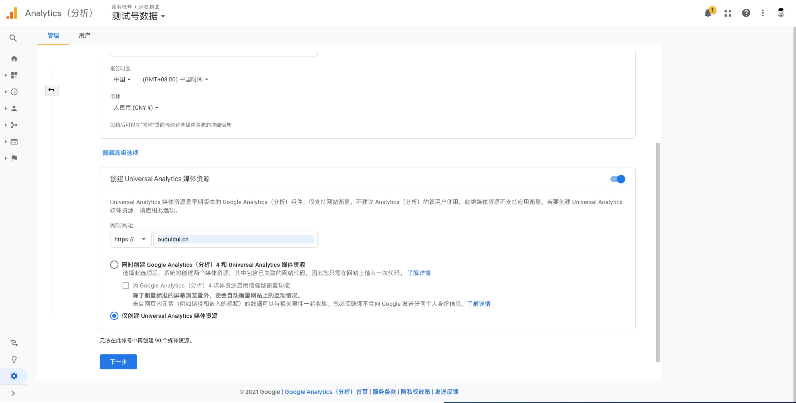
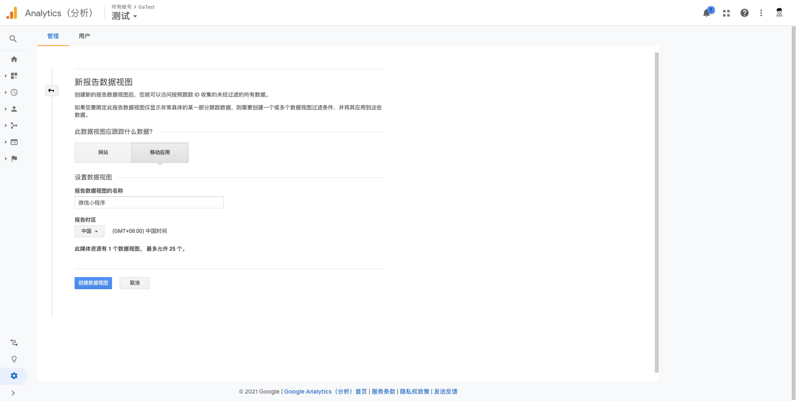
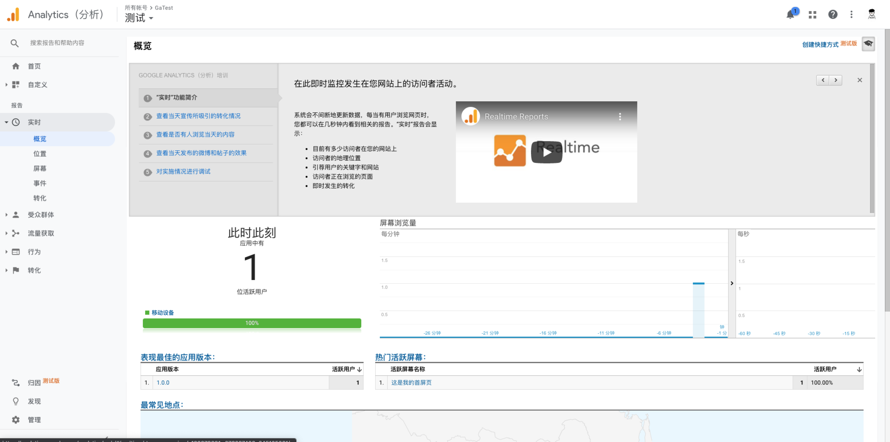

# 适用于UniApp和微信小程序的谷歌统计 (Google Analytics) SDK

[](https://github.com/OUDUIDUI/ga-tracker/stargazers)[](https://github.com/OUDUIDUI/ga-tracker/network)[](https://github.com/OUDUIDUI/ga-tracker/blob/master/LICENSE)

完整实现了 [Measurement Protocol](https://developers.google.com/analytics/devguides/collection/protocol/v1/reference)，并且API接口和 [Google Analytics for Android](https://developers.google.com/analytics/devguides/collection/android/v4/) 保持高度一致。

## 快速入门

### Google Analytics 设置

> 新版已经不能直接创建`移动应用`类型的媒体资源了，因为选了`移动应用`就需要连接Firebase中的移动项目。

首先在你的账号下，创建一个新的媒体资源，并且点开`高级选项`，勾选`创建Universal Analytics`。



创建成功后，保存一下你的`跟踪id`。

然后在该媒体资源下新建数据视图，选择`移动应用`，然后将原来的默认视图删除。



### 安装

如果你使用`UniApp`框架开发的话，或者`WePY`、`mpVue`框架，可以使用`npm`进行安装。

```shell
npm install @ouduidui/ga-tracker
```

如果你使用微信小程序原生开发的话，即将[`ga.js`](https://github.com/OUDUIDUI/ga-tracker/releases)导入你的项目中。

### 合法域名

如果你是开发小程序的话，我们需要将上报域名设置为白名单。但是`www.google-analytics.com`域名没有国内备案，无法添加到微信小程序的`request合法域名`中。

因此你需要自己有一个已备案域名，然后用起或者二级域名去重定向到`www.google-analytics.com`。

> 如果只是本地开发测试，可以先不用设置，只要把开发工具里面`开发环境不校验请求域名以及 TLS 版本`勾选一下，等递交审核前再去设置合法域名。

具体方法：

1. 在跟踪器上设置自定义跟踪服务器 `tracker.setTrackerServer("https://ga-proxy.example.com")`
2. 修改域名`example.com`的DNS记录，将 `ga-proxy.example.com` 指向你自己的服务器IP
3. 自己服务器上的`nginx`做如下配置

```shell
upstream real_ga_servers {
        server www.google-analytics.com:443 weight=5 max_fails=0;
        keepalive 64;
}

server {    
   listen 443 ssl;
   server_name ga-proxy.example.com;
   
   ssl on;
   # 设置ssl证书（略）

    location / {

        # 告诉ga用户真实ip
        rewrite ^(.*)$   $1?uip=$remote_addr    break;
    
        proxy_set_header   Host       www.google-analytics.com;

        # Proxy to google-analytics.com
         proxy_buffering off;

        # 使用keepalive
         proxy_http_version 1.1; # require  nginx > 1.1.4
         proxy_set_header Connection ""; # for keepalive upstream

         proxy_pass https://real_ga_servers;
         proxy_redirect off;

    }
}
```

`ga-proxy.example.com` 的ssl证书配置请参考相关资料（这里略过）

另外，`www.google-analytics.com`国内有服务器，因此并不需要你的服务器有翻*墙能力就可以转发跟踪数据。

### 使用

> 下面的例子均为`uniapp`写法。

在`main.js`引入。

```js
import {GoogleAnalytics} from "@ouduidui/ga-tracker";

const gaTracker = {
    instance: null,
    getInstance() {
        if (!this.instance) {
            // 初始化GoogleAnalytics Tracker
            this.instance = GoogleAnalytics.getInstance() 
                .setAppName('UniApp')   // 设置名称
                .setAppVersion('1.0.0')   // 设置版本号
                .newTracker('UA-XXXXXX-X');  // 设置跟踪ID

            // #ifdef MP-WEIXIN
            // 使用自己的合法域名做跟踪数据转发
            this.instance.setTrackerServer("https://ga-proxy.example.com");
            // #endif
        }
        return this.instance;
    },
}

Vue.prototype.$gaTracker = gaTracker;
```

在`index.vue`中尝试一下简单的ScreenView统计。

```vue
<template>
	<view class="content">
		<image class="logo" src="/static/logo.png"></image>
		<view>
			<text class="title">{{title}}</text>
		</view>
	</view>
</template>

<script>
    import {HitBuilders}  from "@ouduidui/ga-tracker";

	export default {
		data() {
			return {
				title: 'Hello'
			}
		},
		onShow() {
		    // 设置屏幕名称
      	const t = this.$gaTracker.getInstance()
		    t.setScreenName('这是我的首屏页');
		    // 上报
		    t.send(new HitBuilders.ScreenViewBuilder().build());
		}
	}
</script>
```

此时已运行项目既可在`ga`中实时查看到。



## 功能特点

* 完整实现 [Measurement Protocol](https://developers.google.com/analytics/devguides/collection/protocol/v1/reference)
* 支持多个匹配数据批量上报
* 因为微信小程序只支持10个`wx.request`并发，为了不影响业务数据的网络请求，数据上报的时候按顺序进行，最多占用一个`wx.request`

## [API参考](./docs/api.md)

## 代码示例

### 跟踪器 Tracker

跟踪器用来收集数据并发送给谷歌统计服务器。跟踪器跟谷歌统计的媒体资源相对应，你可以创建多个跟踪器分别对应不同的媒体资源。

```javascript
// gaTracker.js

import ga from "@ouduidui/ga-tracker";

const GoogleAnalytics = ga.GoogleAnalytics;

let gaTracker = null;

function getInstance() {
    if(!gaTracker) {
        // 初始化GoogleAnalytics
        gaTracker = GoogleAnalytics.getInstance()
            .setAppName('应用名称')   // 设置APP名称
            .setAppVersion('版本号')   //设置APP版本号，[可选]
            .newTracker('跟踪id');  // 创建一个跟踪器 Tracker

      	// #ifdef MP-WEIXIN
        // 使用自己的合法域名做跟踪数据转发
        gaTracker.setTrackerServer('https://ga.example.com');
      	// #endif
      
      	// 设置用户ID
      	// User ID用来进行跨应用和跨设备的同一用户跟踪，比如你可以把用户的 `UnionID` 设置为 User ID。
      	// 你需要先在谷歌分析后台的媒体资源里面启用User ID跟踪功能。
				gaTracker.setUserId('123456');
    }

    return gaTracker;
}

export default getInstance()
```

多数情况下我们只需要用一个跟踪器，因此建议在 `main.js` 中全局共享一个跟踪器：

```javascript
import Vue from 'vue'
import App from './App'
// 引入gaTracker.js
import gaTracker from "./utils/gaTracker";

// 注册全局API
Vue.prototype.$gaTracker = gaTracker;

Vue.config.productionTip = false

App.mpType = 'app'

const app = new Vue({
    ...App
})
app.$mount()

```

跟踪器的使用。

```vue
<script>
	export default {
		onShow() {
            // 后续的所有匹配数据都会使用这个屏幕名称
            this.$gaTracker.setScreenName('首页');

            // this.$gaTracker.send(Hit) 上报数据
		}
	}
</script>
```

### 匹配构建 HitBuilder

用来构建一次匹配所需要的所有参数，`HitBuilder` 提供了所有匹配类型都需要的一些公共方法。   

一般不需要直接使用 `HitBuilder` , 请根据实际匹配类型使用下面的 `ScreenViewBuilder`, `EventBuilder`, `ExceptionBuilder`, `TimingBuilder`

#### 屏幕 ScreenView

屏幕表示用户在你的应用内查看的页面。

```vue
<script>
import {HitBuilders} from "@ouduidui/ga-tracker";

	export default {
			onShow() {
            // 后续的所有匹配数据都会使用这个屏幕名称
            this.$gaTracker.setScreenName('首页');

            // 上报
            this.$gaTracker.send(new HitBuilders.ScreenViewBuilder().build());
			}
	}
</script>
```

支持自定义维度和指标（你需要在Google Analytics后台预先定义好）

```javascript
this.$gaTracker.send(new HitBuilders.ScreenViewBuilder()
    .setCustomDimension(1,"维度1")
    .setCustomDimension(2,"维度2")
    .setCustomMetric(1,100.35)
    .setCustomMetric(2,200).build());
```

> **提醒：** 自定义维度和指标在所有 `HitBuilder` 上都能设置。

#### 事件 Event

事件可帮助你衡量用户与你的小程序中的互动式组件的互动情况，例如按钮点击等。  

每个事件由 4 个字段组成: **类别**，**操作**，**标签**和**值**。其中**类别**和**操作**这两个参数是必须的。

```javascript
this.$gaTracker.send(new HitBuilders.EventBuilder()
    .setCategory('按钮')  // 事件类别
    .setAction('点击')  // 事件动作
    .setLabel('上报') // 事件标签 可选
    .setValue(1)  // 事件值 可选
    .build()); 
```

#### 崩溃和异常 Exception

你可以在应用中把捕获到的异常信息进行统计。

```javascript
this.$gaTracker.send(new HitBuilders.ExceptionBuilder()
    .setDescription('异常描述信息')  
    .setFatal(false).build()); // 可选，是否严重错误，默认为 true
```

#### 用户计时

计时器有四个参数：**类别**，**值**，**名称**，**标签**。其中**类别**和**值**是必须的，**值**的单位是毫秒。

```javascript
this.$gaTracker.send(new HitBuilders.TimingBuilder()
    .setCategory('计时器')
    .setValue(63000)
    .setVariable('用户注册')
    .setLabel('表单').build());
```

### 会话管理

默认的会话时长是30分钟，可以在谷歌分析媒体资源一级进行设置。你也可以在发送匹配时使用 `setNewSession` 方法来手动开始一个新会话。

```javascript
this.$gaTracker.send(new HitBuilders.ScreenViewBuilder()
    .setNewSession()
    .build());
```

### 电子商务活动相关

典型的增强型电子商务实现将会衡量产品展示次数以及以下任一操作：

* 选择产品。
* 查看产品详情。
* 内部促销信息的展示和选择。
* 向购物车中添加产品或从中移除产品。
* 开始产品结帐流程。
* 购买和退款。

> **注意：** 
>
> 增强型电子商务数据只能随现有的匹配（例如 `screenview` 或 `event`）一起发送。如果您设置了电子商务值但没有发送任何匹配，或在设置电子商务值之前就发送了匹配，则系统将不会发送电子商务数据。   
>
> 并且需要在Google Analytics后台，在对应的媒体资源中启用 **增强型电子商务功能** 。


>  **提醒** ：以下示例需要用到 `HitBuilders`, `Product`, `ProductAction`, `Promotion`。

```javascript
import {HitBuilders, Product, ProductAction, Promotion} from "@ouduidui/ga-tracker";
```

#### 衡量展示

要衡量产品展示，请构建 `Product` 对象，并使用 `addImpression` 方法随匹配发送此对象。`Product` 必须有 `name` 或 `id` 值。其他所有值都非必需，可以不用设置。

```javascript
// 在一个 "Search Results" 的列表中展示了商品 P12345
const product = new Product()
    .setId("P12345")  // id
    .setName("Android Warhol T-Shirt")   // 名称
    .setCategory("Apparel/T-Shirts") // 分类
    .setBrand("Google") // 品牌
    .setVariant("Black") // 款式
    .setPosition(1) // 在列表中位置
    .setCustomDimension(1, "Member"); // 产品范围的自定义维度#1

const builder = new HitBuilders.ScreenViewBuilder()
    .addImpression(product, "Search Results");
    // .addImpression(product2, "Search Results")   // 在同一个列表中可以加入更多商品
    // .addImpression(product3, "Search Results2")   // 也可以加入更多列表

this.$gaTracker.setScreenName("searchResults")
    .send(builder.build());
```

#### 衡量操作

操作的衡量方法如下：使用 `addProduct` 方法和 `Product` 对象来添加产品详情，并使用 `setProductAction` 方法和 `ProductAction` 对象来指定用户执行的操作。

例如，以下代码衡量对搜索结果列表中展示的某个产品的选择：

```javascript
const product = new Product()
    .setId("P12345")  // id
    .setName("Android Warhol T-Shirt")   // 名称
    .setCategory("Apparel/T-Shirts") // 分类
    .setBrand("Google") // 品牌
    .setVariant("Black") // 款式
    .setPosition(1) // 在列表中位置
    .setCustomDimension(1, "Member"); // 产品范围的自定义维度#1

const productAction = new ProductAction(ProductAction.ACTION_CLICK)  // 商品点击
    .setProductActionList("Search Results");

const builder = new HitBuilders.ScreenViewBuilder()
    .addProduct(product)
    .setProductAction(productAction);

this.$gaTracker.setScreenName("searchResults")
    .send(builder.build());
```

#### 合并展示和操作数据

既有产品展示又有操作时，可以将两者合并到同一次匹配中进行衡量。

下例显示了如何衡量一次在相关产品部分中的展示以及一次产品详情查看：

```javascript
const relatedProduct =  new Product()
    .setId("P12346")
    .setName("Android Warhol T-Shirt")
    .setCategory("Apparel/T-Shirts")
    .setBrand("Google")
    .setVariant("White")
    .setPosition(1);

const viewedProduct =  new Product()
    .setId("P12345")
    .setName("Android Warhol T-Shirt")
    .setCategory("Apparel/T-Shirts")
    .setBrand("Google")
    .setVariant("Black")
    .setPosition(1);

const productAction = new ProductAction(ProductAction.ACTION_DETAIL);

const builder = new HitBuilders.ScreenViewBuilder()
    .addImpression(relatedProduct, "Related Products")
    .addProduct(viewedProduct)
    .setProductAction(productAction);

this.$gaTracker.setScreenName("product")
    .send(builder.build());
```

一般购物流程是展示列表，点击查看商品详情，加入购物车，结账。

下面是把一个商品加入购物车的例子：

```javascript
const product = new Product()
    .setId("P12345"); // Id或者Name其中一个必须设置
const productAction = new ProductAction(ProductAction.ACTION_ADD);
const builder = new HitBuilders.ScreenViewBuilder()
    .addProduct(product)
    .setProductAction(productAction);

this.$gaTracker.setScreenName("transaction")
    .send(builder.build());
```

下表列出商品所有操作：

| 参数值                                 | 说明                                       |
| -------------------------------------- | ------------------------------------------ |
| `ProductAction.ACTION_ADD`             | 把商品加入购物车                           |
| `ProductAction.ACTION_CHECKOUT`        | 描述结算流程，可以分几步进行               |
| `ProductAction.ACTION_CHECKOUT_OPTION` | 结算选项，比如选择支付方式，选择快递方式等 |
| `ProductAction.ACTION_CLICK`           | 商品点击操作                               |
| `ProductAction.ACTION_DETAIL`          | 查看商品详情                               |
| `ProductAction.ACTION_PURCHASE`        | 交易，订单支付完成                         |
| `ProductAction.ACTION_REFUND`          | 退款                                       |
| `ProductAction.ACTION_REMOVE`          | 商品从购物车移除                           |

#### 衡量交易

交易的衡量方法如下：使用 `addProduct` 方法和 `Product` 对象来添加产品详情，并使用 `setProductAction` 方法和 `ProductAction` 对象来指定购买操作。总收入、税费、运费等交易级详情在 `ProductAction` 对象中提供：

```javascript
const product = new Product()
    .setId("P12345")
    .setName("Android Warhol T-Shirt")
    .setCategory("Apparel/T-Shirts")
    .setBrand("Google")
    .setVariant("Black")
    .setPrice(29.20)
    .setCouponCode("APPARELSALE")
    .setQuantity(1);
const productAction = new ProductAction(ProductAction.ACTION_PURCHASE)
    .setTransactionId("T12345")  // 订单id
    .setTransactionAffiliation("Google Store - Online")  // 交易关联公司
    .setTransactionRevenue(37.39) // 【重要】这个是订单总价，包含了 税费 和 运费
    .setTransactionTax(2.85)  // 税费
    .setTransactionShipping(5.34)   // 邮费
    .setTransactionCouponCode("SUMMER2013");  // 优惠券编号
const builder = new HitBuilders.ScreenViewBuilder()
    .addProduct(product)
    .setProductAction(productAction);

this.$gaTracker.setScreenName("transaction")
    .send(builder.build());
```

##### 指定货币

默认情况下，您可以通过 Google Analytics（分析）的管理网络界面为所有交易和商品配置一种通用的全局货币。

局部货币必须按 ISO 4217 标准指定。如需支持的完整转换货币列表，请参阅[货币代码参考文档](https://developers.google.com/analytics/devguides/platform/features/currencies)。

局部货币使用 currencyCode 跟踪器属性来指定。例如，此跟踪器将以欧元发送货币金额值：

```js
...

this.$gaTracker.set("&cu", "EUR");  // 设置货币
this.$gaTracker.send(builder.build());
```

> 要详细了解 Google Analytics（分析）中的货币转换机制，请参阅电子商务功能参考中的[多种货币](https://developers.google.com/analytics/devguides/platform/features/ecommerce#specifying-currencies)部分。

#### 衡量退款

要为整个交易退款，请使用 `setProductAction` 方法和 `ProductAction` 对象来指定交易 ID 和退款操作类型：

```javascript
const productAction = new ProductAction(ProductAction.ACTION_REFUND)
    .setTransactionId("T12345");  // 订单号
const builder = new HitBuilders.ScreenViewBuilder()
    .setProductAction(productAction);

this.$gaTracker.setScreenName("refund")
    .send(builder.build());
```

如果未找到相符的交易，则退款将不会得到处理。

要衡量部分退款，请使用 `setProductAction` 方法和 `ProductAction` 对象来指定要退款的交易 ID、产品 ID 和产品数量：

```javascript
const product = new Product()
    .setId("P12345")  // 退款的商品id
    .setPrice(20.23) // 退款时可以不是原价退还
    .setQuantity(1);  // 退款的数量
const productAction = new ProductAction(ProductAction.ACTION_REFUND)
    .setTransactionId("T12345");  // 退款单号
const builder = new HitBuilders.ScreenViewBuilder()
    .addProduct(product)
    .setProductAction(productAction);

this.$gaTracker.setScreenName("refundProduct")
    .send(builder.build());
```

##### 为退款使用非互动事件

如果您需要使用事件来发送退款数据，但该事件不属于通常衡量的行为（即并非由用户发起），则建议您发送非互动事件。这可让特定指标免受该事件的影响。例如：

```javascript
const productAction = new ProductAction(ProductAction.ACTION_REFUND)
    .setTransactionId("T12345");
const builder = new HitBuilders.EventBuilder()
    .setProductAction(productAction)
    .setNonInteraction(true) // 设置非互动事件
    .setCategory("Ecommerce")
    .setAction("Refund");

this.$gaTracker.send(builder.build());
```

#### 衡量结帐流程

为衡量结帐流程中的每个步骤，您需要：

1. 添加跟踪代码，以衡量结帐流程中的每一步。
2. 如果适用，添加跟踪代码以衡量结帐选项。
3. （可选）设置直观易懂的步骤名称以用于结帐渠道报告，方法是在网页界面的“管理”部分中配置**电子商务设置**。

##### 1. 衡量结帐步骤

对于结帐流程中的每一步，您都需要实现相应的跟踪代码，以便向 Google Analytics（分析）发送数据。

**Step 字段**

对于要衡量的每一个结帐步骤，您都应加入 `step` 值。此值用于将结帐操作映射到您在电子商务设置中为每个步骤配置的标签。

> 注意：如果您的结帐流程只有一步，或是您没有在电子商务设置中配置结帐渠道，则可以不设置 `step` 字段。

**Option 字段**

在衡量某个结帐步骤时，如果您有关于此步骤的更多信息，则可以为 `checkout` 操作设置 `option` 字段来捕获此信息，例如用户的默认付款方式（如“Visa”）。

###### 衡量某个结帐步骤

要衡量某个结帐步骤，请使用 `addProduct` 方法和 `Product` 对象来添加产品详情，并使用 `setProductAction` 方法和 `ProductAction` 对象来指示结帐操作。如果适用，还可以设置该结帐步骤的 `step` 和 `option`。

下例显示了如何衡量结帐流程的第一步（一个产品，拥有关于付款方式的额外信息）：

```javascript
const product = new Product()
    .setId("P12345")
    .setName("Android Warhol T-Shirt")
    .setCategory("Apparel/T-Shirts")
    .setBrand("Google")
    .setVariant("Black")
    .setPrice(29.20)
    .setQuantity(1);

const productAction = new ProductAction(ProductAction.ACTION_CHECKOUT)
    .setCheckoutStep(1)
    .setCheckoutOptions("Visa");
const builder = new HitBuilders.ScreenViewBuilder()
    .addProduct(product)
    .setProductAction(productAction);

this.$gaTracker.setScreenName("checkoutStep1")
  	.send(builder.build());
```

##### 2. 衡量结帐选项

结帐选项可让您衡量关于结帐状态的额外信息。有时您已经衡量了某个结帐步骤，但在用户设置了选项之后，关于此步骤有了新的额外信息，在这种情况下，结帐选项就可以派上用场。例如，用户选择了送货方式。

要衡量结帐选项，请使用 `setProductAction` 来指示结帐选项，并加入步骤序号和选项说明信息。

> 请注意：您不应设置任何产品或展示数据。

您很可能希望在用户执行特定操作进入结帐流程中的下一步时衡量此操作。例如：

```javascript
// (On "Next" button click.)
const productAction = new ProductAction(ProductAction.ACTION_CHECKOUT_OPTION)
    .setCheckoutStep(1)
    .setCheckoutOptions("FedEx");
const builder = new HitBuilders.EventBuilder()
    .setProductAction(productAction)
    .setCategory("Checkout")
    .setAction("Option");

this.$gaTracker.send(builder.build());

// Advance to next page.
```

##### 3. 结帐渠道配置

您可以为结帐流程中的每一步指定一个描述性的名称，以在报告中使用。要配置此类名称，请转到 Google Analytics（分析）网络界面的管理部分，选择相应数据视图（配置文件），然后点击电子商务设置。请按照相应电子商务设置说明，为要跟踪的每个结帐步骤设置标签。

> 注意：如果您不配置结帐步骤名称，它们将会显示为“第 1 步”、“第 2 步”、“第 3 步”等等。

#### 衡量内部促销

增强型电子商务功能支持对内部促销信息的展示次数和点击次数进行衡量，例如对促销活动进行宣传的横幅。

##### 促销信息展示

内部促销信息的展示一般在初始屏幕浏览发生时衡量，并使用 `addPromotion` 方法和 `Promotion` 对象来指定促销详情。例如：

```js
const promotion = new Promotion()
    .setId("PROMO_1234")  // 促销id
    .setName("Summer Sale")  // 促销名称
    .setCreative("summer_banner2")  // 促销素材
    .setPosition("banner_slot1");  // 促销位置

const builder = new HitBuilders.ScreenViewBuilder()
    .addPromotion(promotion);

this.$gaTracker.setScreenName("promotions")
    .send(builder.build());
```

> **重要提示：** 虽然可以为促销信息展示设置操作，但该操作不能是促销信息点击操作。如果您要衡量促销信息点击操作，应在促销信息展示之后，在单独的匹配中发送该操作。

##### 促销信息点击

内部促销信息点击的衡量方法如下：使用 `addPromotion` 方法和 `Promotion` 对象以及 `setPromotionAction` 方法来指示促销信息点击操作。例如：

```js
const promotion = new Promotion()
    .setId("PROMO_1234")
    .setName("Summer Sale")
    .setCreative("summer_banner2")
    .setPosition("banner_slot1");

const builder = new HitBuilders.EventBuilder()
    .setCategory("Internal Promotions")
    .setAction("click")
    .setLabel("Summer Sale")
    .addPromotion(promotion)
    .setPromotionAction(Promotion.ACTION_CLICK)  // 促销动作

this.$gaTracker.send(builder.build());
```

促销信息的操作只有2个：

| 参数值                   | 说明                                                         |
| ------------------------ | ------------------------------------------------------------ |
| `Promotion.ACTION_VIEW`  | 这是默认操作，只需要在 `HitBuilder` 上调用 `addPromotion` 即可 |
| `Promotion.ACTION_CLICK` | 促销信息点击操作，需要在 `HitBuilder` 上用 `setPromotionAction` 设置 |

### 广告系列和流量来源归因

你可以使用 `setCampaignParamsFromUrl` 方法在匹配构建器 `HitBuilder` 中直接设置广告系列参数，以便将一系列会话中的用户活动归因到特定的引荐流量来源或营销广告系列：

```javascript
this.$gaTracker.setScreenName(screenName);

// Note: 这只是示例，网址 ? 前面部分其实没有用处，主要是utm_XXXXX系列参数的解析
const campaignUrl = "http://example.com/index.htmlutm_source=email&utm_medium=email_marketing&utm_campaign=summer&utm_content=email_variation_1";

// Campaign data sent with this hit.
this.$gaTracker.send(new HitBuilders.ScreenViewBuilder()
    .setCampaignParamsFromUrl(campaignUrl)
    .build()
);
```

> **重要提醒：** 如果你想跟踪广告带来的新用户，那么一定要保证 `setCampaignParamsFromUrl` 应用在该新用户发送的第一个匹配上。

你也可以在跟踪器上通过 `setCampaignParamsOnNextHit` 设置：

```javascript
this.$gaTracker.setScreenName(screenName);
const campaignUrl = "http://example.com/index.htmlutm_source=email&utm_medium=email_marketing&utm_campaign=summer&utm_content=email_variation_1";
this.$gaTracker.setCampaignParamsOnNextHit(campaignUrl); // 下一个发送的匹配会带上这些参数
				.send(new HitBuilders.ScreenViewBuilder().build());
```

##### 跟踪微信小程序的场景值

可以把微信小程序的场景值当成流量来源来进行跟踪。要跟踪场景值需要在`App`的`onLaunch`中处理

```javascript
onLaunch: function(options) {
    console.log('App Launch');
    if (options && options.scene) {
        const campaignUrl = CampaignParams.buildFromWxAppScene(options.scene).toUrl();
        this.$gaTracker.setCampaignParamsOnNextHit(campaignUrl);

        // 下一个发送的匹配就会带上微信场景信息
        // this.$gaTracker.send(Hit) 
    }
}
```

`CampaignParams.buildFromWeappScene`会把场景值转化为`utm_source`和`utm_medium`参数进行跟踪。

##### 跟踪路径参数

在对应 `Page` 的 `onLoad` 里面用 `CampaignParams.parseFromPageOptions` 识别二维码中的广告参数：

```javascript
onLoad(options) {
    // 解析options中的 utm_xxxxxx 参数，生成一个广告连接 URL
    const campaignUrl = CampaignParams.parseFromPageOptions(options).toUrl();
    this.$gaTracker.setCampaignParamsOnNextHit(campaignUrl);

    // 下一个发送的匹配就会带上广告来源信息
    // t.send(Hit)
}
```

如果 `path` 的参数不是 `utm_` 开头的广告系列参数，那么调用 `parseFromPageOptions` 的时候需要传入第二个参数来指定参数名称的映射关系：

```javascript
onLoad(options) {
  	// options =  { "var1" : "Coffee Bar", "var2" : "Scan Qrcode" }
  
  	const map = {
      	"var1" : "utm_source", // 把 var1 对应到  utm_source
      	"var2" : "utm_medium"
    };
    // 解析options中的 utm_xxxxxx 参数，生成一个广告连接 URL
    const campaignUrl = CampaignParams.parseFromPageOptions(options, map).toUrl();
    this.$gaTracker.setCampaignParamsOnNextHit(campaignUrl);

    // 下一个发送的匹配就会带上广告来源信息
    // t.send(Hit)
}
```

广告系列参数列表

| 参数           | 说明                                                         | 示例                                          |
| -------------- | ------------------------------------------------------------ | --------------------------------------------- |
| `utm_source`   | 广告系列来源，用于确定具体的搜索引擎、简报或其他来源         | utm_source=google                             |
| `utm_medium`   | 广告系列媒介，用于确定电子邮件或采用每次点击费用 (CPC) 的广告等媒介 | utm_medium=cpc                                |
| `utm_term`     | 广告系列字词，用于付费搜索，为广告提供关键字                 | utm_term=running+shoes                        |
| `utm_content`  | 广告系列内容，用于 A/B 测试和内容定位广告，以区分指向相同网址的不同广告或链接 | utm_content=logolink<br/>utm_content=textlink |
| `utm_campaign` | 广告系列名称，用于关键字分析，以标识具体的产品推广活动或战略广告系列 | utm_campaign=spring_sale                      |

查看全部[广告系列参数](https://developers.google.com/analytics/devguides/collection/android/v4/campaigns#campaign-params)。

## 参考资料

- 协议 [Measurement Protocol](https://developers.google.com/analytics/devguides/collection/protocol/v1/reference)  
- 接口参照 [Google Analytics for Android](https://developers.google.com/analytics/devguides/collection/android/v4/)   
- [广告系列参数](https://developers.google.com/analytics/devguides/collection/android/v4/campaigns#campaign-params)

